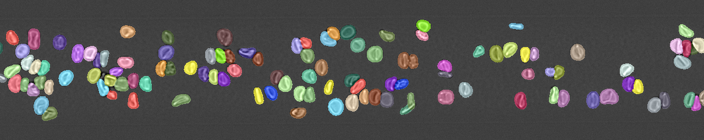

?logo=python&logoColor=rgb(149%2C157%2C165)&labelColor=rgb(50%2C60%2C65))
?logo=TensorFlow&logoColor=rgb(149%2C157%2C165)&labelColor=rgb(50%2C60%2C65))
?logo=NVIDIA&logoColor=rgb(149%2C157%2C165)&labelColor=rgb(50%2C60%2C65))
?logo=NVIDIA&logoColor=rgb(149%2C157%2C165)&labelColor=rgb(50%2C60%2C65))    
&color=rgb(149%2C157%2C165))
&color=rgb(149%2C157%2C165))
&color=rgb(149%2C157%2C165))    

# CENTURI_Poulain_GlobSeg  
Red blood cell segmentation with StarDist

## Index
- [Installation](#installation)
- [Usage](#usage)
- [Comments](#comments)

## Installation

Pease select your operating system

<details> <summary>Windows</summary>  

### Step 1: Download this GitHub Repository 
- Click on the green `<> Code` button and download `ZIP` 
- Unzip the downloaded file to a desired location

### Step 2: Install Miniforge (Minimal Conda installer)
- Download and install [Miniforge](https://github.com/conda-forge/miniforge) for your operating system   
- Run the downloaded `.exe` file  
    - Select "Add Miniforge3 to PATH environment variable"  

### Step 3: Setup Conda 
- Open the newly installed Miniforge Prompt  
- Move to the downloaded GitHub repository
- Run one of the following command:  
```bash
# TensorFlow with GPU support
mamba env create -f environment_tf_gpu.yml
# TensorFlow with no GPU support 
mamba env create -f environment_tf_nogpu.yml
```  
- Activate Conda environment:
```bash
conda activate GlobSeg
```
Your prompt should now start with `(GlobSeg)` instead of `(base)`

</details> 

<details> <summary>MacOS</summary>  

### Step 1: Download this GitHub Repository 
- Click on the green `<> Code` button and download `ZIP` 
- Unzip the downloaded file to a desired location

### Step 2: Install Miniforge (Minimal Conda installer)
- Download and install [Miniforge](https://github.com/conda-forge/miniforge) for your operating system   
- Open your terminal
- Move to the directory containing the Miniforge installer
- Run one of the following command:  
```bash
# Intel-Series
bash Miniforge3-MacOSX-x86_64.sh
# M-Series
bash Miniforge3-MacOSX-arm64.sh
```   

### Step 3: Setup Conda 
- Re-open your terminal 
- Move to the downloaded GitHub repository
- Run one of the following command: 
```bash
# TensorFlow with GPU support
mamba env create -f environment_tf_gpu.yml
# TensorFlow with no GPU support 
mamba env create -f environment_tf_nogpu.yml
```  
- Activate Conda environment:  
```bash
conda activate GlobSeg
```
Your prompt should now start with `(GlobSeg)` instead of `(base)`

</details>


## Usage



### `main.py`
Read a selected `TIF` stack from the `data_path` directory and 
segments/measures the detected red blood cells (RBCs). Segmentation is 
performed using a custom-trained StarDist2D model. Labelled masks and
measurments are saved in the `data_path` directory.

- #### Paths
```bash
- data_path   # str, path to the data directory
```

- #### Parameters
```bash
- stack_name  # str, name (with extension) of the stack to process
- radius      # int, radius for rolling ball background subtraction [*] 
- display     # bool, whether to display labelled masks & measurements in Napari
```
```
The radius should be set to 0, as the current model was trained without 
background subtraction.
```

- #### Outputs
```bash
- ..._predict.tif  # TIF, labelled masks saved as uint16
- ..._predict.csv  # CSV, measurments saved in an annotated CSV file
```
```bash
- frame            # frame number for the segmented object
- label            # object label
- area             # object area (pixels)
- ctrd_x           # x-coordinate of the object centroid (pixels)
- ctrd_y           # y-coordinate of the object centroid (pixels)
- maj_axis         # major axis length of fitted ellipse (pixels)
- min_axis         # minor axis length of fitted ellipse (pixels)
- eccentricity     # from 0 (circle) to 1 (line)
- orientation      # angle of the major axis orientation, from -π/2 to π/2
```

### `functions.py`
Contains helper functions required to run `main.py`

### `models`
Includes the custom-trained StarDist2D model, as well as code used to extract
the training data (`model_extract.py`) and train the model (`model_train.py`).
Note that these scripts are no longer maintained and may require adjustments to
run.

## Comments